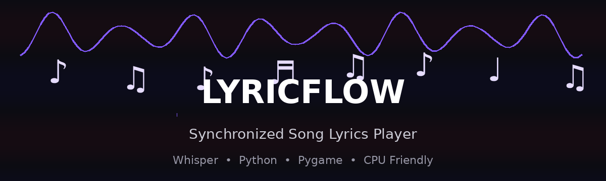

<div align="center">

# 🎵 LYRICFLOW

### 🎤 Synchronized Song Lyrics Player

**Play a song and watch its lyrics flow in real time — directly in your terminal.**



<br/>


</div>

---

## ✨ What is LyricFlow?

**LyricFlow** is a lightweight Python project that turns an audio song into a synchronized terminal lyrics experience.

Instead of printing the complete transcription at once, LyricFlow:

```text
🎵 Loads the song
      ↓
🎤 Transcribes vocals with Faster-Whisper
      ↓
⏱️ Gets word-level timestamps
      ↓
▶️ Plays the original audio
      ↓
📝 Displays lyrics according to the song timing
```

The goal is a simple **karaoke/movie-caption style experience inside the terminal**.

---

## 🎬 Demo

When you run the program:

```text
🎵 NOW PLAYING

▶ Song started...

I remember the night
      ↓
I remember the night we
      ↓
remember the night we had
      ↓
the night we had together
```

The displayed words move forward as the song plays.

---

## 🚀 Features

- 🎵 Plays the original song automatically
- 🎤 Uses **Faster-Whisper** for transcription
- ⏱️ Uses **word-level timestamps**
- 📝 Displays lyrics progressively
- 💻 Runs directly in the terminal
- 🧠 CPU-friendly configuration
- 🌐 No external API required
- 🔐 No API key required
- 🎧 Supports common audio formats supported by the installed audio backend
- ⚡ Lightweight and easy to modify

---

## 🛠️ Tech Stack

| Technology | Purpose |
|---|---|
| 🐍 Python | Core application |
| 🎤 Faster-Whisper | Speech-to-text & word timestamps |
| 🔊 Pygame | Song playback |
| ⏱️ Python Time | Synchronization |
| 💻 Terminal | Lyrics display |

---

## 📁 Project Structure

```text
lyrics-generator/
│
├── lyrics_generator.py
├── Aint Nobody - Masstamilan.MY.mp3
├── assets/
│   └── lyricflow-banner.gif
└── README.md
```

> **Tip:** Do not commit copyrighted commercial songs to a public repository unless you have the necessary rights. Keep the audio file local or use a royalty-free sample.

---

## ⚙️ Installation

### 1. Clone the repository

```bash
git clone YOUR_REPOSITORY_URL
cd lyrics-generator
```

### 2. Install dependencies

```bash
python -m pip install faster-whisper pygame
```

### 3. Verify NumPy

```bash
python -c "import numpy as np; print(np.__version__); print(np.array([1,2,3]))"
```

### 4. Add your song

Put your audio file inside the project folder.

Example:

```text
lyrics-generator/
└── my_song.mp3
```

### 5. Set the song path

Open `lyrics_generator.py` and update:

```python
SONG_PATH = r"my_song.mp3"
```

If the song is somewhere else:

```python
SONG_PATH = r"C:\Users\YourName\Music\my_song.mp3"
```

---

## ▶️ Run the Project

```bash
python lyrics_generator.py
```

On the first run, Faster-Whisper may download the selected model.

After the model is ready:

```text
🎵 Loading Whisper model...
✅ Whisper model loaded.
🎤 Analyzing song...

✅ Detected lyrics.

============================================================
                    🎵 NOW PLAYING
============================================================

▶ Song started...

your lyrics appear here...
```

---

## 🧠 How Synchronization Works

The important part of the project is **word-level timestamps**.

Instead of receiving only:

```text
I remember the night we met
```

Whisper provides timing information approximately like:

```text
I          → 0.50s
remember   → 0.72s
the        → 1.15s
night      → 1.35s
we         → 1.80s
met        → 2.00s
```

The program compares those timestamps with the current playback position:

```python
current_time = pygame.mixer.music.get_pos() / 1000.0
```

and displays the corresponding lyrics.

---

## 🎯 Current Architecture

```text
                 ┌───────────────────┐
                 │     Audio File    │
                 │      MP3 / WAV    │
                 └─────────┬─────────┘
                           │
                           ▼
                 ┌───────────────────┐
                 │ Faster-Whisper    │
                 │ Transcription     │
                 └─────────┬─────────┘
                           │
                           ▼
                 ┌───────────────────┐
                 │ Word Timestamps   │
                 │ Start / End Time  │
                 └─────────┬─────────┘
                           │
              ┌────────────┴────────────┐
              ▼                         ▼
      ┌───────────────┐         ┌───────────────┐
      │    Pygame     │         │    Terminal   │
      │  Play Audio   │────────▶│ Show Lyrics   │
      └───────────────┘         └───────────────┘
```

---

## ⚡ CPU Configuration

LyricFlow is designed to work without a dedicated GPU.

The default configuration uses:

```python
model = WhisperModel(
    "base",
    device="cpu",
    compute_type="int8"
)
```

For better transcription quality, you can try:

```python
MODEL_SIZE = "small"
```

However, the `small` model will generally require more CPU processing time.

### Model choice

| Model | Speed | Accuracy | CPU Usage |
|---|---|---|---|
| `tiny` | ⚡⚡⚡ | ⭐⭐ | Low |
| `base` | ⚡⚡ | ⭐⭐⭐ | Moderate |
| `small` | ⚡ | ⭐⭐⭐⭐ | Higher |

**Recommended starting point:** `base`

---

## ⚠️ Accuracy Notes

LyricFlow uses automatic speech recognition, so it may not perfectly reproduce every lyric.

Accuracy can be affected by:

- 🎸 Loud instrumental music
- 🎤 Vocal effects
- 🥁 Heavy drums
- 👥 Multiple singers
- 🔊 Background noise
- 🎶 Rap/fast vocals
- 🗣️ Overlapping voices

For a future version, vocal separation can be added before transcription:

```text
Song
 ↓
Vocal Separation
 ↓
Clean Vocal Track
 ↓
Whisper
 ↓
Word Timestamps
 ↓
Synchronized Lyrics
```

This can significantly improve song-lyrics transcription.

---

## 🗺️ Roadmap

- [x] 🎵 Play audio
- [x] 🎤 Generate transcription
- [x] ⏱️ Word timestamps
- [x] 📝 Terminal lyrics flow
- [x] 💻 CPU support
- [ ] 🎯 Better word highlighting
- [ ] 🎤 Vocal/instrumental separation
- [ ] 🌈 Colorized karaoke lyrics
- [ ] ⏸️ Pause / Resume
- [ ] ⏭️ Seek forward/backward
- [ ] 🔊 Volume control
- [ ] 🌐 Web-based lyrics player
- [ ] 📱 Responsive UI
- [ ] 🎶 `.lrc` lyrics export

---

## 🤝 Contributing

Contributions are welcome!

```bash
git checkout -b feature/new-feature
git add .
git commit -m "Add new feature"
git push origin feature/new-feature
```

Then open a Pull Request.

---

## 📜 License

This project is released under the **MIT License**.

---

<div align="center">

### 🎵 Built with Python, Whisper & a love for music.

**If you like this project, consider giving it a ⭐**

<br/>

`Made for learning • Built for fun • Powered by AI`

</div>
